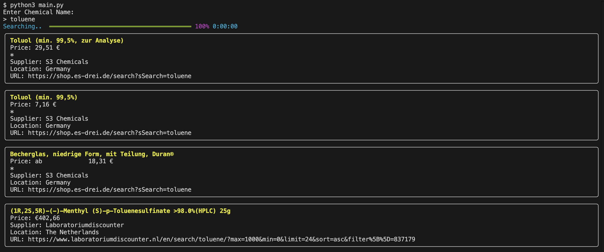
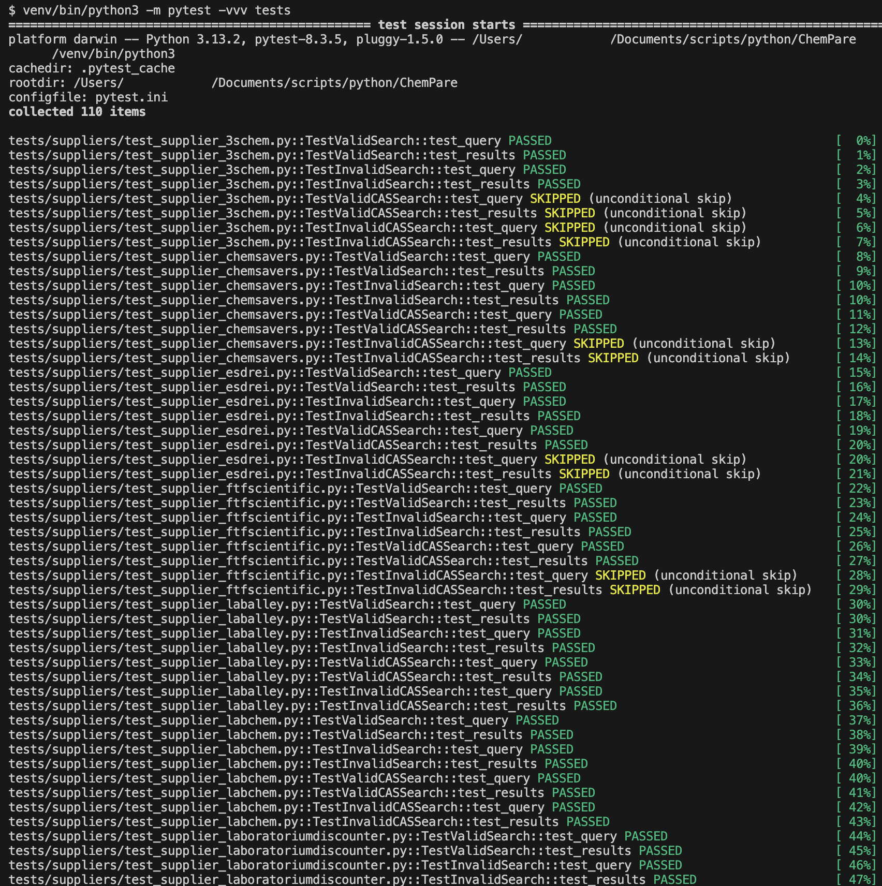

# ChemPare
### Intro
Compares prices from chemical vendors that sell to individuals and residential addresses.

> _*Note:* This project is a work in progress, not yet in Beta mode_

---

### How does it work
Magic, mostly.

---

### Installation

#### Python Enviroment Setup

##### Try using the Makefile (OSX)

1. Checkout this repo
```bash
git clone https://github.com/YourHeatingMantle/ChemPare.git
```

2. Go to repo directory and run Makefile
```bash
cd ChemPare
make install
```

3. Run script
```bash
make run
```

##### Manual setup

1. Install Python 3.13.1

2. Checkout this repo
```bash
git clone https://github.com/YourHeatingMantle/ChemPare.git
```

3. Create pyenv environment

Optional. ([documentation here](https://packaging.python.org/en/latest/tutorials/installing-packages/#optionally-create-a-virtual-environment)).
```bash
cd ./ChemPare
python3 -m venv venv
```

4. Go to the folder and activate the python env

<small>_On Linux/OSX:_</small>

```bash
source ./venv/bin/activate
```

If you're doing development work and using VSCode, then install some useful Python extensions using the [code command](https://code.visualstudio.com/docs/setup/mac#_launch-vs-code-from-the-command-line):

```bash
code --install-extension ms-python.black-formatter
code --install-extension ms-python.debugpy
code --install-extension ms-python.python
code --install-extension ms-python.isort
code --install-extension ms-python.vscode-pylance
code --install-extension njqdev.vscode-python-typehint
code --install-extension wolfieshorizon.python-auto-venv
code --install-extension rodolphebarbanneau.python-docstring-highlighter
```

<small>_On Windows:_</small>

```powershell
# tbd....
```

5. Install project packages
```bash
./venv/bin/pip install -r requirements.txt
```

6. Run main script, and provide a chemical name or CAS.

```
python3 main.py
```

Example output:



## Unit Tests

To get the unit tests to fire, you need to install the dev packages.

<small>__On OSX:__</small>

If you're on OSX, just run `make install-dev` then `make test`.

<small>__Other OS:__</small>

1. Follow the regular install steps
2. Run the following:

```bash
./venv/bin/pip3 install --upgrade pip
./venv/bin/pip3 install -r requirements/dev.txt
. ./venv/bin/activate

```
3. Run the below to execute all unit tests in `./tests` directory:

```bash
venv/bin/python3 -m pytest -vvv tests
```

The output should look simiar to the following:




## Suppliers To Add
- https://www.jk-sci.com
- https://www.chemworld.com/searchresults.asp?Search=potassium&Submit=
- https://www.sciencecompany.com/Search?Keywords=acid&ManufacturerId=0&categoryId=670&PageSize=48
- https://carolinachemical.com/
    https://carolinachemical.com/wp-json/wp/v2/search?search=borohydride
    https://carolinachemical.com/wp-json/wp/v2/product/6981
